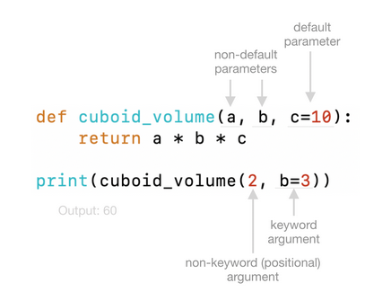

# Cheatsheet: More on Functions

In this section, we learned:

* Fucntions can have more than one **parameter**:
```
def volume(a, b, c):
    return a * b * c
```

* Functions can have **default** paramenters (e.g. ```coefficient```):
```
def converter(feet, coefficient = 3.2808):
    meters = feet / coefficient
    return meters

print (converter(10))
```
Output would be ```3.0480370641306997```

* Arguments can be passed as **non-keyword** (positional) arguments (e.g. ```a```) or **keyword** arguments (e.g. ```b=2``` and ```c=10```):

```
def volume(a, b, c):
    return a * b * c
print(volume(1, b=2, c=10))
```

* An ***args*** parameter allows the function to be called with an arbitrary number of non-keyword arguments:

```
def find_max(*args):
    return max(args)
print(find_max(3, 99, 1001, 2, 8))
```
Output would be: ```1001```

* An ***kwargs*** parameter allows the function to be called with an arbitrary number of keyword arguments:

```
def find_winner(**kwargs):
    return max(kwargs, key = kwargs.get)

print(find_winner(Andy = 17, Mary = 19, Sim = 45, Kae = 34))
```
Output ```Sim```

* Here's a summary of function elements:
