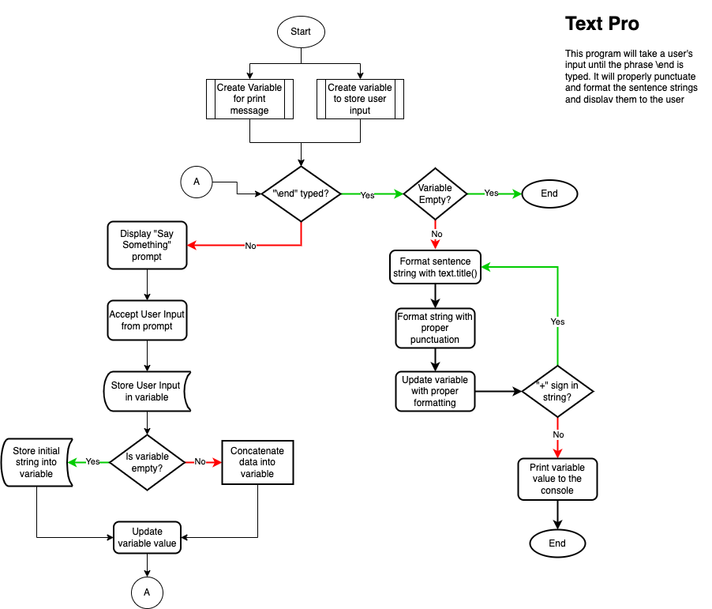

# Problem Statement for the TextPro program

## Summary
We are going to write a program over the next few lessons that will be used to handle some text work. We neeed to think about the problem and how we might solve it. 

## What does it do?
An important questiomn to ask is what does this program do? What is its purpose? It is essentially not applicable to a real world program since it really doesn't do anything. However, we do know what it is supposed to do which we will summarize here:

1. The program will present a prompt that says "Say Something" and will ask for user input.
2. The user inputs a text string such as "It's good weather today" and presses enter. 
3. The program stores what is typed and prompts the user with the same prompt allowing them to enter additional strings. 
4. When the user wants to end the program, they must have some input method to do so. We will use the keyword ```\end``` to tell the program we are done.
5. The input that the user provides will be added to a continually growing string storing each entry as a complete sentence. 
6. All input must be converted to proper paragraph form (capitalized first letter of the sentence, proper punctuation, etc.) before the input is provided. 
7. The finalized output must be presented after the user types the ```\end``` command with all strings properly connected and formatted.
8. The program will then end. 

## Code ideas/pseudocode
1. Create a prompt to display "Say something"
2. Allow user input after the prompt.
3. Create a variable to store the input from the user.
4. Allow the prompts to concatenate the strings of each input together. 
5. Use a loop that will end when the phrase ```\end``` is typed (likely a do while loop). 
6. Format the various strings with proper sentence structure (capitalization, proper punctuation, etc.)
7. Create a print function to print the entire, properly formatted string.
8. End the program

## Code flowchart

